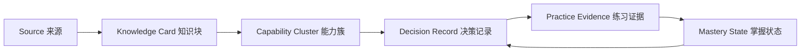

# Photography Mentor：第一性原理整合

日期：2026-08-02  
最终发布校准：2026-09-07  
版本：v1.3.0

## 1. 从用户要完成的工作出发

摄影学习的最小闭环不是“读完一篇教程”，而是：

1. 明确这张照片或这次拍摄想解决什么。
2. 区分已经知道的事实、工具测得的数据和仍未验证的推断。
3. 找到当前最限制结果的一个判断。
4. 用来源可追溯的知识解释这个判断。
5. 只改变一个变量，形成可比较的作品证据。
6. 用成功标准和失败信号复盘。
7. 在新场景再次验证，形成可迁移能力。

因此，产品的核心对象不是文章、课程或聊天消息，而是一个可验证的 `Decision Record`。

## 2. 统一决策契约

每次 Mentor 输出必须包含：

- `task`：任务类型、题材和当前知识路径。
- `facts`：用户陈述、EXIF、本地图像指标和历史学习状态。
- `assumptions`：根据事实提出、但仍需验证的解释。
- `unknowns`：会显著改变建议的缺失信息。
- `bottleneck`：本轮唯一的第一瓶颈。
- `knowledge`：支持判断的知识块、命中原因与来源。
- `action`：一次拍摄或一次后期即可执行的单变量动作。
- `verification`：成功标准、失败信号和下一份证据。
- `review`：用于迁移和间隔复习的问题。

这解决了旧版本中“检索命中很多，但不知道先做什么”的问题。

## 3. 知识不是一个平铺列表

知识层由三种对象组成：

### Source

描述知识从哪里来，并标记来源类型：

- `primary`：论文、官方文档、课程、规范或数据集。
- `curated`：摄影教程、方法文章和整理资料。
- `local-synthesis`：本机摄影资料的主题级总结。
- `user-notes`：用户登录后主动导入的课程笔记。
- `restricted-index`：只知道入口和栏目、没有授权正文的受限站点。

### Knowledge Card

每个知识块包含概念摘要、Mentor 用法、练习、评片问题和来源 ID。卡片是检索与引用的最小单位。

### Capability Cluster

74 个知识块被映射到 7 个学习阶段和 22 个能力簇。能力簇负责回答“这个知识帮助用户形成哪一种判断”，而不是复刻书籍目录。

## 4. 检索为什么必须混合

单纯关键词检索有三个问题：

1. 长文本和重复关键词会占据前排。
2. 同一来源可能垄断答案。
3. 命中不等于适合当前任务或学习阶段。

Mentor Core 同时使用：

- 中文二元、三元词和英文术语匹配。
- 任务模式与知识阶段路由。
- 题材、领域和能力簇匹配。
- 来源类型权重。
- 领域与来源重复惩罚。
- 本机总结配额和一手资料保障。

默认 6 个检索结果中，本机主题总结最多占 2 个；相关时至少保留 1 个，一手或官方资料不会被本机关键词淹没。

## 5. Agent 的职责边界

Mentor Core 是确定性的浏览器内决策引擎，不宣称具备完整视觉语义理解。

它可以：

- 路由任务、检索资料、引用来源和安排练习。
- 使用浏览器像素统计和常见 EXIF 形成技术证据。
- 把判断压缩为一个可验证瓶颈。
- 更新 Session、掌握度和复习时间。

它不能：

- 在没有图像证据时假装看过照片。
- 把亮度、清晰度等统计量等同于审美质量。
- 把个人风格偏好写成普遍规则。
- 代替用户确认纪实真实性、比赛规则、产权或商业授权。

## 6. 本机资料的隐私模型

私有索引包含路径和文件清单，因此不得进入公开运行时。构建脚本只导出：

- 12 个主题级总结。
- 13 个脱敏集合来源。
- 总资料数量与总体积。
- 能力簇映射、练习和评片问题。

构建和发布验证会拒绝以下内容：

- Windows 绝对路径。
- 指向本机文件协议的链接。
- 用户目录。
- `sourceFiles`、`fileName`、`sourceRoot` 字段。
- 本机文件清单或下载来源标记。

## 7. 产品主链路

### 普通问答

文字问题 → 意图路由 → 证据缺口 → 第一瓶颈 → 混合检索 → 决策单 → 单变量练习。

### 照片评片

本地像素与 EXIF → 技术诊断 → 第一瓶颈 → 同一 Mentor Core → 成功标准 → before/after 证据。

### 今日 Session

学习档案与复习到期 → 能力簇 → 网络与本机知识共同出题 → 分层提示 → 实拍迁移 → 掌握度更新。

### 资料库

用户搜索 → 同一混合检索 → 命中原因、能力阶段、来源链接和练习同时呈现。

## 8. 可验证指标

- 62 个网络知识块 + 12 个本机主题总结 = 74 个统一知识块。
- 28 个网络来源 + 13 个本机集合来源 = 41 个发行包证据来源；界面另注册 1 个仅承载用户自有 SYBJ 摘要的浏览器本地来源通道。
- 7 个学习阶段、22 个能力簇保持为唯一学习骨架。
- 检索结果引用覆盖率必须为 100%。
- 本机总结发布物不得命中任何路径和私有清单规则。
- 有照片与诊断证据时置信度可以提高；没有照片时必须明确为有限判断。

## 9. 评测与反馈闭环

第一版固定评测集包含 14 类代表任务，逐项检查：

- 第一瓶颈是否符合预期。
- 任务是否进入正确学习阶段。
- 前 6 张知识卡是否至少命中一张人工标注相关卡。
- 引用覆盖率是否为 100%。
- 本机总结是否遵守配额；需要一手证据的任务是否包含一手或官方来源。

Web 应用同时记录三类浏览器本地反馈：`accepted`、`rejected` 和带结果证据的 `verified`。记录包含瓶颈、置信度、知识卡 ID 与用户主动填写的验证证据，用于后续分析“建议是否真正改变了摄影决策”，而不是只统计点击量。

## 10. 后续演进

下一阶段应优先增加评价数据，而不是继续扩充资料量：

1. 把固定评测集扩展为真实用户问题与困难负例，并按题材分层报告。
2. 用采纳、拒绝和 before/after 结果校准置信度，而不是优化点击率。
3. 用人工评片标注校准瓶颈分类，而不是训练审美总分。
4. 在接入真实多模态模型后，仍保留同一证据账本和决策契约。
