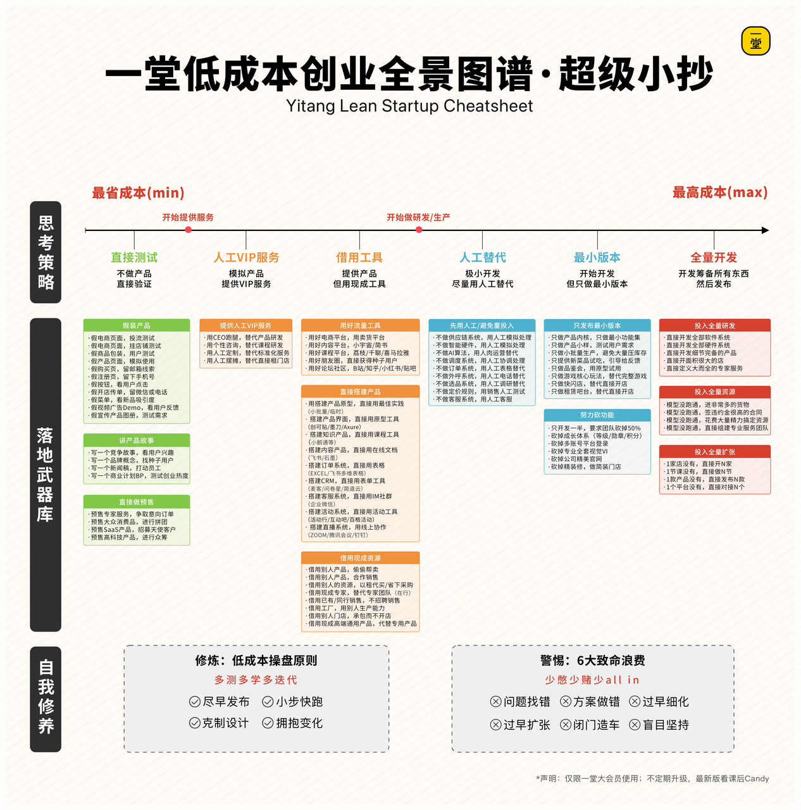
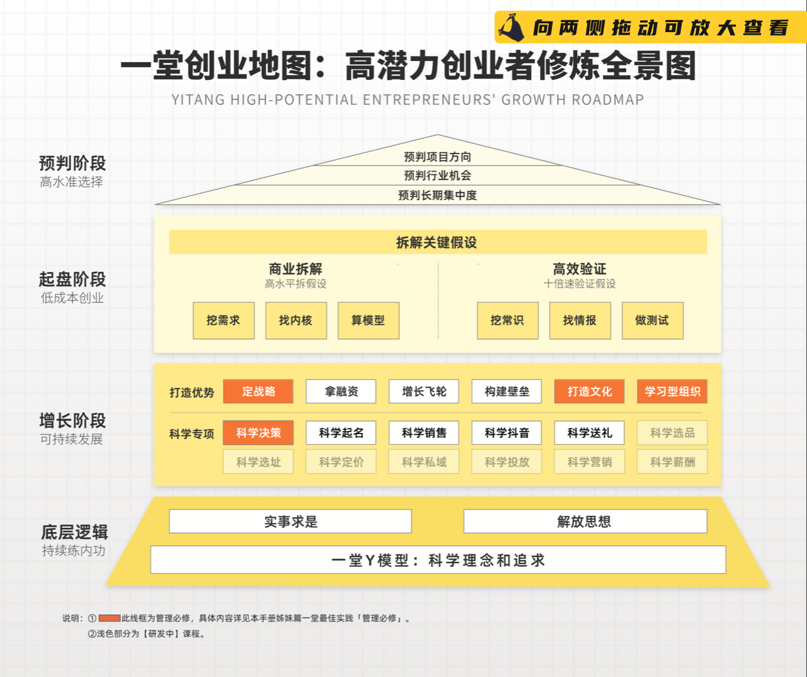
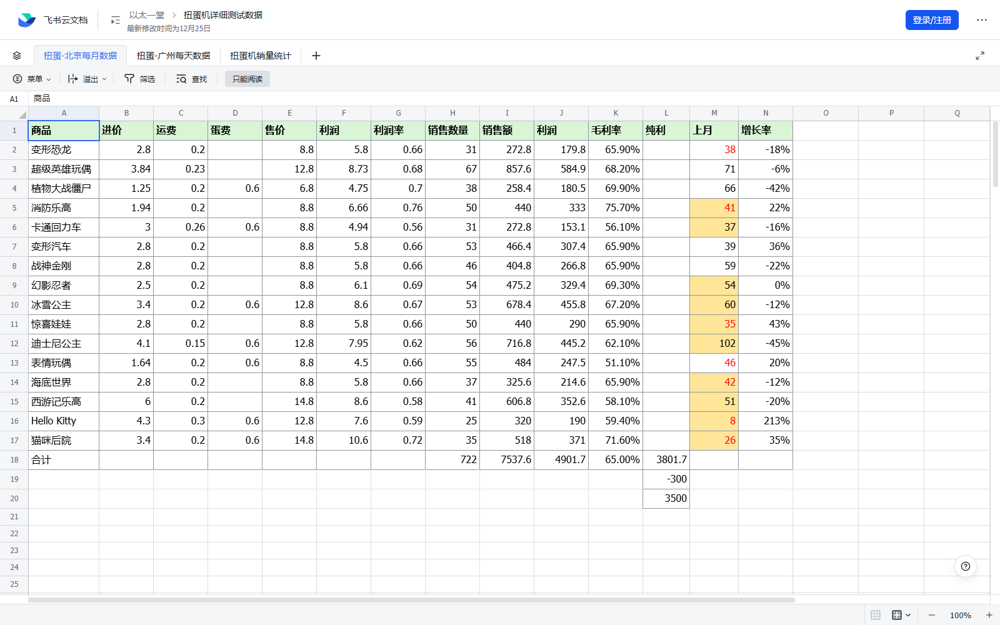
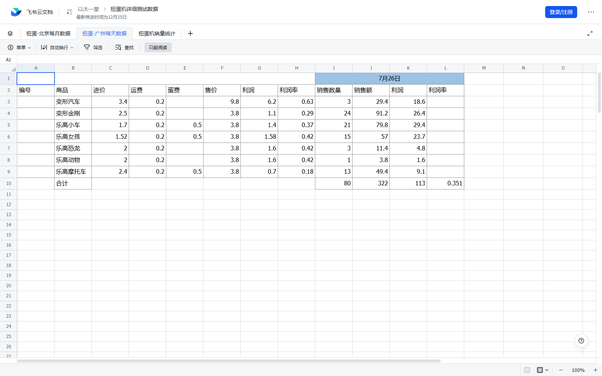
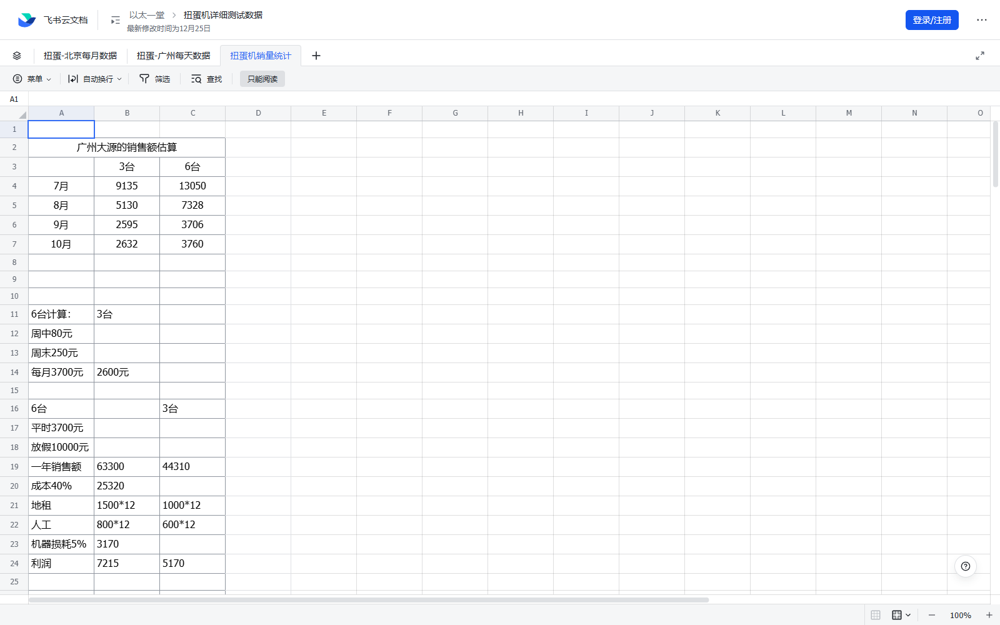

# 《聪明精益》课后 Candy 学习笔记

更新时间：2026-07-15  
课程：[聪明精益：张磊的 3 个业务实验](https://yitang.top/lesson/5WdV5f34d2d94267)  
作业状态：已提交，`answerId=1680021`；NPS 9；答案未公开。  
资料边界：本文是原创提炼和证据索引，不保存付费文档逐字稿，也不把课程自报数据写成外部审计事实。

## 完成范围

| Candy | 内容 | 学习状态 | 本地证据 |
|---|---|---|---|
| 1791 | 张磊 3 个业务的五步法画布 | 已读完并交叉比较 | 本文“五步画布”与 `knowledge/yitang-5wdv-candy-index.json` |
| 1792 | 张磊给一堂学员的一封信 | 已读完 11 组问答，2 张核心图已缓存 | `notes/assets/yitang-5wdv-candy/letter-visual-01.png`、`letter-visual-02.png` |
| 1793 | 扭蛋机和动漫社区电商业务数据包 | 两篇运营记录和飞书表格 3 个工作表均已核对 | 3 张表格截图与数据摘要 |

## Candy 1791：三个业务的五步画布

五步画布的价值不是把商业计划写完整，而是强迫团队把“用户问题、产品内核、赚钱单位、增长质量和壁垒”分开。三项业务的比较如下。

| 业务 | 需求与场景 | 产品内核 | 关键单元模型 | 增长第一指标 | 壁垒判断 |
|---|---|---|---|---|---|
| 内衣洗衣液 | 一二线 20-35 岁女性；洗澡时顺带手洗；血渍和异味 | 去血渍、长留香 | 单订单、单用户 | 年营收 4000 万并保持盈利 | 品牌强；迁移成本中等 |
| 扭蛋机 | 3-12 岁儿童是用户，家长是客户；商场、医院、餐饮等等待或经过场景 | 易用、好玩、平价 | 单订单、单柜、单点位、单商圈、单城市、单配送；单点位风险最高 | 年增 500 点位、点位毛利率超过 20%、月营收超过 100 万 | IP 较强；独家点位中等；规模效应弱 |
| 动漫电商 | 15-25 岁重度日漫用户；稀缺、正品和预算约束 | 正品、稀缺、低价 | 单订单、单用户、单活动、单展会 | 月增用户 3000、购买转化率 20%、月营收 200 万 | 独家授权强；成本优势中等；规模效应弱 |

### 商业教练应追问

1. 同一个“用户”是否同时是使用者、付款者和决策者？扭蛋机案例说明三者可能分离。
2. 单元模型要落到真正承受风险的粒度。线下设备不是只算单机，还要算点位、配送、商圈和城市。
3. 增长指标必须同时覆盖规模、质量和安全。只设收入目标，会隐藏毛利、现金流和复制成本。
4. 壁垒要说明强度与载体；“我们有技术/品牌/社区”不是可判定结论。

## Candy 1792：学员答疑的 8 条可迁移认知

### 1. 用五步法预判难关

“有没有人要、卖什么、能否卖动、能否赚钱、能否卖爆和规模化”分别对应需求、产品内核、商业模式、增长和壁垒。预判的产物不是确定答案，而是一张待验证风险地图。

### 2. 低成本没有固定段位

不做产品、人工服务、借工具、人工替代、最小版本和全量开发是一条成本谱。实验应服从当前关键问题；为了显得精益而拒绝必要产品，同样会让证据失真。

### 3. 2B/2G 先区分风险类型

- 已有成熟方案、目标是做得更好：优先和种子客户共同验证产品内核。
- 最大风险是持续拿单所需资源：优先访谈专家、竞品和价值链角色，识别政府背书、品牌、技术或关系资源。
- 访谈只能降低认知风险；真实采购流程、预算和合同仍需行为证据。

### 4. 性格是取证工具，不是创业标签

内向或外向不是业务能力结论。关键是为了拿到信息、销售或组织协同，能否在不同情境切换行为。

### 5. 创业能力按阶段调用

预判阶段选择方向，起盘阶段拆假设并验证，增长阶段打造组织能力；底层是实事求是、解放思想和知行合一。阶段错配会导致还没跑通单元模型就学习规模化管理。

### 6. 假产品只替代不需要验证的部分

洗衣液测试可以借现成液体和 3D 打印瓶验证包装、香味与购买感知，但不能用它证明长期去渍、稳定性或安全。每次实验必须标记“替代了什么、仍真实保留什么”。

### 7. 渠道扩张先做出一个可复用单店模型

先在关系较好的少量门店测试，再用销量、补货、客诉和利润记录进入连锁渠道。代理可以缩短触达，但无法替代准入门槛、坑位费、供应和动销能力。

### 8. 用户错配会让平台效应作废

动漫业务早期积累手办用户，后续主要由周边用户变现，导致原有用户资产没有顺延。平台业务应同时验证“谁产生网络价值”和“谁贡献收入”，不能用总注册量掩盖人群错位。

> 课程答疑提到内衣洗衣液在中日市场合计年营收达“大几千万”。这属于课程方自报结果，只用于理解案例后续，不作为独立审计事实。

## Candy 1793：数据包与运营账本

### 扭蛋机：从目标到反证

- 两周测试使用 8 台机器，初始定价 10 元/次，目标 40 枚/天。
- 5 月 25 日后把价格降到 5 元，增加展示柜、音乐、周边联动优惠券和完整值守日；新目标为 60 枚/天，其中儿童 40、二次元 20。
- 5 月 23-27 日共售 95 枚，日销量为 12、9、12、26、36，均值 19；没有达到原目标，但后两日明显上升。
- SKU 中小车 27 枚领先，小猪佩奇 12、银魂 10、口袋妖怪 9。儿童品类更强，但价格、展示和值守同时变化，不能把增量单独归因给某个动作。

### 三张表的关键读数

北京月度表按 SKU 同时记录进价、运费、蛋壳、售价、利润率、销量、销售额和上月对比。可见合计为 722 件、销售额 7537.6、毛利 4901.7、毛利率约 65%；表内还出现 3801.7、-300 和 3500 的净利/调整值，但原表没有在截图区域给出完整标签，因此只保留为待核口径。

广州 7 月 26 日表记录 7 个 SKU，合计销量 80、销售额 322、利润 113、利润率 35.1%。销量主要来自变形金刚 24、乐高小车 21、乐高女孩 15、乐高摩托车 13；这说明选品贡献高度不均，补货和陈列不应按 SKU 平均分配。

销售额估算表比较 3 台与 6 台机器：7-10 月收入显著回落，模型给出的全年销售额约 4.431 万与 6.33 万；扣除 40% 成本、地租、人工和 5% 机器损耗后，估算利润约 5170 与 7215。即使机器数翻倍，固定成本与淡旺季使利润并不线性增长。

### 动漫电商：吞吐量也是单位经济

- 课程记录的单件成本合计 10.15 元，包含 4 元进价、1.5 元国际运费，以及捡货、分货、核对、打包、物料、快递、仓储和上架等成本。
- 人工上架约 6 分钟/件、2 元/件、60 件/人日；程序辅助后约 4 分钟/件、1.33 元/件、90 件/人日。2 万件仍约需 222 人日和 2.66 万元。
- 首次仓库最小面积估算为 170 平方米，选择北京意味着约增加 40% 成本，换取更好的管理稳定性和灵活性。
- 第一场漫展记录：约 1200 人经过，约 400 人进店；消费总额 4335 元、167 件、72 位付款者，人均 2.3 件、客单约 60 元。记录中另有“消费 80 人”的漏斗口径，与 72 位付款者不一致，应在复盘时先统一定义。
- 线上计划把每天 3000 条信息录入、每周 1 万件上架、缺货率低于 1% 与销售目标连接起来。增长瓶颈不仅是流量，也可能是商品信息生产和库存同步吞吐量。

## 对 AI / 互联网业务的升级

1. **五步画布增加证据列**：每个假设必须标注证据等级、数据日期、反证阈值和责任人。
2. **把人工兜底写进单元模型**：像电商上架一样记录每个 AI 任务的人工分钟、重试、审核和异常处理成本。
3. **用户与收入人群分开建图**：内容社区、AI 平台和双边市场分别记录使用者、贡献者、付款者与预算拥有者。
4. **增长先找吞吐瓶颈**：获客之外，还要检查数据准备、模型推理、人工审核、集成、客服和合规容量。
5. **实验保持可归因**：一次只改一个主变量；若无法做到，就明确记录混杂因素，不把相关性写成因果。

## 学习边界

- 三个 Candy 页面、两篇运营文档和飞书表格三个工作表均已实际读取。
- 表格截图是课程历史运营记录的代表性证据，不是完整数据镜像，也不能证明当前市场仍有相同结果。
- 作业已提交且 Candy 已解锁；除必需的作业提交外，没有把学习笔记发布到一堂个人界面。
