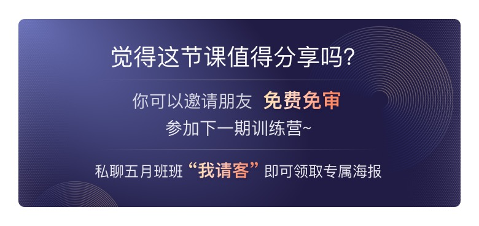
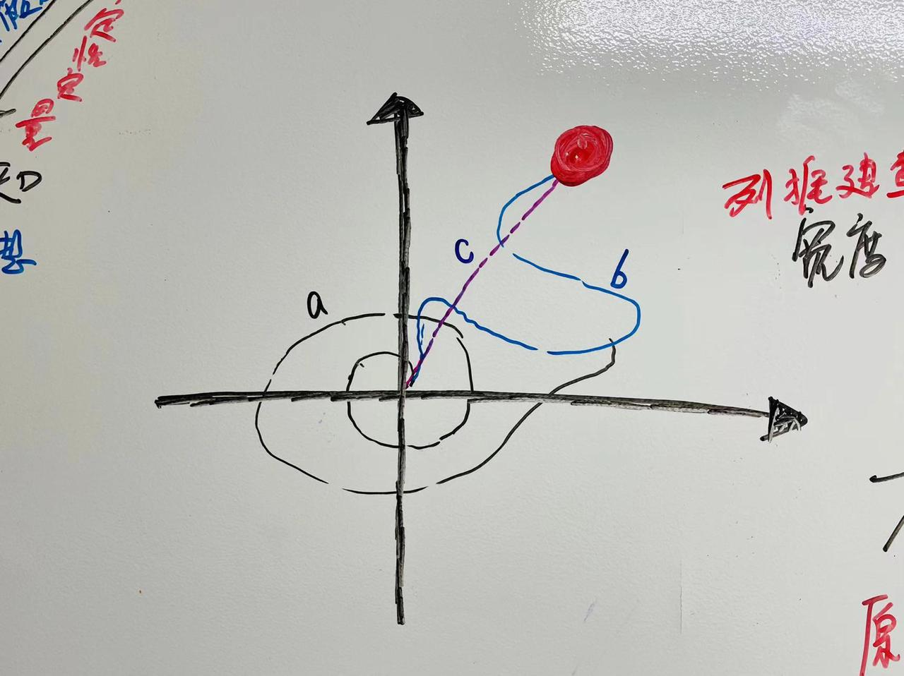
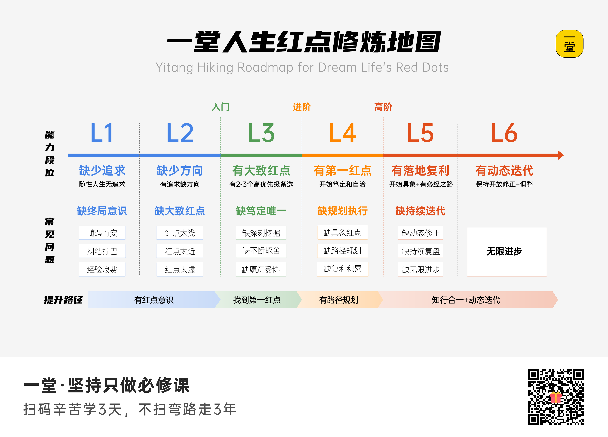

# 一堂 1869：人生红点认知篇学习笔记

整理时间：2026-07-11  
课程入口：https://yitang.top/lesson/section/1869  
课程文稿：https://yitang.top/fs-doc/Hr_f655f23747552/ARXvdczdToXuCgxId4UcO5LOnla?fromAcl=lesson-founder  
Candy 页：https://yitang.top/lesson/Hr_f655f23747552?tab=candy

> 这是一份面向个人学习与商业教练 RAG 的原创摘要，只保留方法、图意和应用推演，不保存逐字稿，也不收录学员评论与作业原文。

## 1. 课程定位

课程要解决的不是“下一份工作选什么”，而是一个更高层的问题：一个长期有追求、仍有选择空间的人，如何形成足够稳定的人生坐标系，让几十年的选择、能力与资源产生复利。

“人生红点”可以理解为一个阶段性终局假设。它通常包含三部分：

1. 最想守住的终极选择，例如作品、成就、成长、生活或影响力。
2. 主要实现路径，例如产品创新、教育、创业或专业深耕。
3. 需要持续积累的能力与资源。

它不是一次性找到的标准答案，也不是人格标签。好的红点需要足够远大以产生自驱，足够抽象以保持稳定，足够务实以能被路径、里程碑和行动支撑。

## 2. 最重要的一张图：终局决定路径质量

图中红点代表长期终局。a、b 一类路径在局部机会之间绕行，可能很努力，也可能阶段性有收益，但能力与经验未必朝同一方向复利；c 是从当下原点朝红点不断校准的路径。

这张图不能被误读成“人生必须完全走直线”。更准确的理解是：方向稳定、路径可调整。现实中会有试错和绕路，但每次选择都应该提高对终局、路径或自身能力的认识。

## 3. 餐巾纸诊断：从有限候选到终局排序

餐巾纸诊断先用极端问题提高时间尺度：如果一生只能做成一件最重要的事，什么最不愿意放弃？然后把可能的终局分别写下，结合历史选择、高峰体验、低谷体验、羡慕对象和未来画面进行排序。

课程给出的常见候选包括：赚钱、成就、作品、出名、生活、体验、过程、内心和高手。候选不是人格分类，也不是要求其他维度归零，而是为了在发生冲突时识别 Top 1。

判断红点不能只听口头表态，应看三个行为表征：

- 笃定：重大选择不再频繁拧巴，知道什么最重要、什么可以妥协。
- 自驱：更容易专注和投入，感觉是在为自己的长期追求工作。
- 自我闭环：能力、行动和结果形成正循环。

## 4. 三层诊断模型

### 第一层：状态

先用“是否自洽”和“是否在舒适区”观察当前做事状态。高压力但不自洽的人，容易进入持续自我怀疑；自洽但始终在舒适区的人，则可能长期低头做事却缺少突破。

自洽的工作定义是：知道长期最渴望什么，关键选择与此一致，眼下能力也在朝同一方向积累。状态层只能发现症状，不能代替后续的理念和取舍。

### 第二层：理念

人生红点适合长期有追求、仍有选择、愿意用理性方法讨论的人。它把商业中的战略、ROI、路径设计和假设验证迁移到人生决策：

- 战略：哪些选择在长期真正影响成败。
- ROI：怎样提高几十年时间与注意力的利用效率。
- 路径：目标、能力、资源、进步方式和里程碑是否一致。
- 假设：未知部分先形成假设，再通过体验、访谈和行动校准。

### 第三层：取舍

课程用“结果/过程”和“现实/理想”两个维度提高讨论的 MECE 程度。重点不是把人永久框进象限，而是站在 30–50 年尺度上，识别最能点燃自己的方向。

真正的取舍不是“选作品就不能赚钱”，而是明确冲突时的优先级：第一红点追求 90 分以上，其他维度守住可接受底线。核心问题是：你愿意为了什么，阶段性妥协什么？

## 5. 三次跃迁与六项修养

### 跃迁一：从无意识到有意识

1. 勇敢追求终局：先允许终局远大，也允许早期表达保持抽象。职业会变化，底层渴望可以更稳定。
2. 笃定红点 ROI：用数天、数周甚至更长时间做调研、访谈、对标和体验，换取未来几十年更高的选择效率。

### 跃迁二：从有意识到有红点

3. 善于深挖红点：通过历史选择、高低峰体验、对标人物和多轮追问，把表层职业偏好下钻到稳定渴望。
4. 敢于不断取舍：明确 Top 1 与底线，使用极端二选一暴露真实优先级，但不把其他价值压到零。

### 跃迁三：从有红点到有规划

5. 努力规划路径：用个人五步法连接能力、资源、进步方式、里程碑和人生红点。
6. 持续动态调整：终局相对稳定，越靠近当下的能力、资源与里程碑越需要随认知和环境更新。

## 6. 修炼地图

地图给出六个能力段位：

| 段位 | 状态 | 主要缺口 |
| --- | --- | --- |
| L1 | 缺少追求 | 没有终局意识，选择随遇而安 |
| L2 | 缺少方向 | 有追求但红点太浅、太近或太虚 |
| L3 | 有大致红点 | 有 2–3 个候选，但缺少深挖、取舍与自洽 |
| L4 | 有第一红点 | 已开始笃定，但缺具体红点、路径规划和复利积累 |
| L5 | 有落地复利 | 有路径与必经之路，但缺动态修正、复盘和进一步进步 |
| L6 | 动态迭代 | 方向、行动与复盘形成长期闭环 |

提升路径是：红点意识 → 找到第一红点 → 路径规划 → 知行合一与动态迭代。

## 7. 个人五步法

把红点落地时，应放在一页纸上持续维护：

| 模块 | 要回答的问题 |
| --- | --- |
| 能力 | 到达终局必须掌握什么？当前最大的能力缺口是什么？ |
| 资源 | 需要哪些团队、关系、资本、数据、渠道或工具？ |
| 进步方式 | 用最佳实践、项目交付、刻意练习还是高质量反馈成长？ |
| 里程碑 | 哪些阶段性成果能够证明方向和能力正在成立？ |
| 人生红点 | 哪个长期结果最不愿妥协？为什么值得投入几十年？ |

“Want / Need / Can”发生冲突时，课程倾向让 Want 承担更高权重：机会会变化，能力可以培养，而长期渴望一旦被持续忽略，容易让局部最优替代真正重要的方向。这不是忽略市场和能力，而是让 Need 与 Can 服务长期 Want。

## 8. 对 Junxian 的应用推演

已知背景：Forward-Deployed AI Engineer，重点是视觉/多模态 AI、模型部署、相机 AI 与评估闭环，并希望把技术能力连接到产品、业务和商业教练 Agent。

以下是待验证假设，不是替你宣布答案：

### 可能的第一红点

**作品型 × 高手型，兼顾成就型。** 长期通过可落地的 AI 产品、行业解决方案和决策系统，把复杂 AI 能力转成真实世界可复用的作品；同时持续成为能跨越模型、产品与业务边界的高手。

### 可能的路径

1. 近期：把视觉/多模态 AI 的工程交付做深，形成可复用评估与部署能力。
2. 中期：从单项目交付升级为 AI 产品/解决方案负责人，掌握客户、价值、销售和商业闭环。
3. 长期：沉淀自己的 AI 业务操作系统、公开作品与商业教练产品，帮助团队更科学地判断和落地 AI。

### 需要验证的关键问题

- 如果只能保留“顶级技术能力、可长期留存的作品、显著商业成就”中的一项，哪项最不可放弃？
- 哪些过去的高峰体验来自解决难技术，哪些来自产品被使用，哪些来自影响别人做出更好决策？
- 个人主页、Business Tutor 与 AI 工程项目，是一条长期主线的不同资产，还是彼此争夺注意力的三个项目？
- 未来三年最值得复利的能力，是多模态工程深度、AI 产品与客户能力，还是知识产品与个人影响力？

## 9. 给 Business Tutor Agent 的产品规则

在高风险职业、创业和长期项目决策中，Agent 应在 ROI 画布前增加一层“红点一致性检查”：

1. 这是局部效率问题，还是会改变长期路径的战略选择？
2. 该选项服务哪个长期终局，积累什么可复利资产？
3. 当前的高收益是否会把用户锁进与红点相反、难以回退的路径？
4. 方案冲突时，用户愿意为第一红点妥协什么，哪些底线不能破？
5. 把长期方向当作假设，定义下一次复盘日期和触发调整的证据。

Agent 不应替用户决定红点，也不应把一次对话结论固化成人格标签。输出中要明确区分用户事实、Agent 推断和待验证假设。

## 10. 作业与 Candy

课程作业二选一：

1. 《我的人生红点》：结合候选红点、Top 3/Top 1、目标路径资源、最短路径、ROI 和人生战略，写清过去的挣扎、现在的排序和未来验证方式；可做一次脱敏的餐巾纸诊断。
2. 感悟与收获：选择 1–3 个最有体感的模型，结合自身经历写变化与启发。

课程提示作业可能公开并进入案例库，因此本次提交前已做脱敏，并选择“不愿意公开”。2026-07-11 已完成《我的人生红点》作业提交，NPS 为 9。提交稿保存在 [作业草稿](yitang-section-1869-homework-draft.md)。

Candy《人生红点精选集》已解锁并完成代表性案例学习。案例库覆盖作品、成就、赚钱、出名、过程、生活、体验、内心与高手等方向；本地仅保存方法归纳和匿名化模式，不保存个人案例全文。详见 [Candy 与 AI 教练评估](yitang-1869-candy-and-red-dot-coach-evaluation.md)。

## 11. 建议的复习与行动

- 30 分钟：先写 9 个候选红点，只排序，不解释。
- 60 分钟：回看三次高峰与三次低谷，寻找反复出现的价值线索。
- 90 分钟：访谈两位熟悉你关键选择的人，询问他们看到的长期一致性与矛盾。
- 一页纸：写出第一红点假设、能力、资源、进步方式和未来 12 个月里程碑。
- 30 天后：用真实选择和行动证据复盘，不以情绪或口号作为验证结果。
